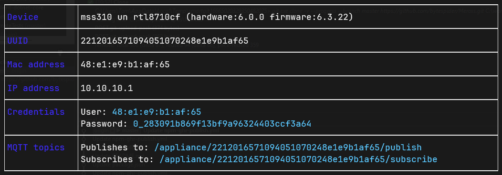

# Meross plugs

\##Adding Meross plug

go to [this](https://github.com/bytespider/Meros) website and follow the steps

to install required npm packages go to main directory that contains `packages.json` and run

````bash
npm install
````

## First

1. put the device into pairing mode and connect to it
1. run 

````bash
npx meross info
````

1. The output should look like this:
1. 

Getting info about device with IP 10.10.10.1

|Device|mss310 un rtl8710cf (hardware:6.0.0 firmware:6.3.22)|
|------|----------------------------------------------------|
|UUID|2212016571094051070248e1e9b1af65|
|Mac address|48:e1:e9:b1:af:65|
|IP address|10.10.10.1|
|Credentials|User: 48:e1:e9:b1:af:65|
||Password: 0_283091b869f13bf9a96324403ccf3a64|
|MQTT topics|Publishes to: /appliance/2212016571094051070248e1e9b1af65/publish|
||Subscribes to: /appliance/2212016571094051070248e1e9b1af65/subscribe|
